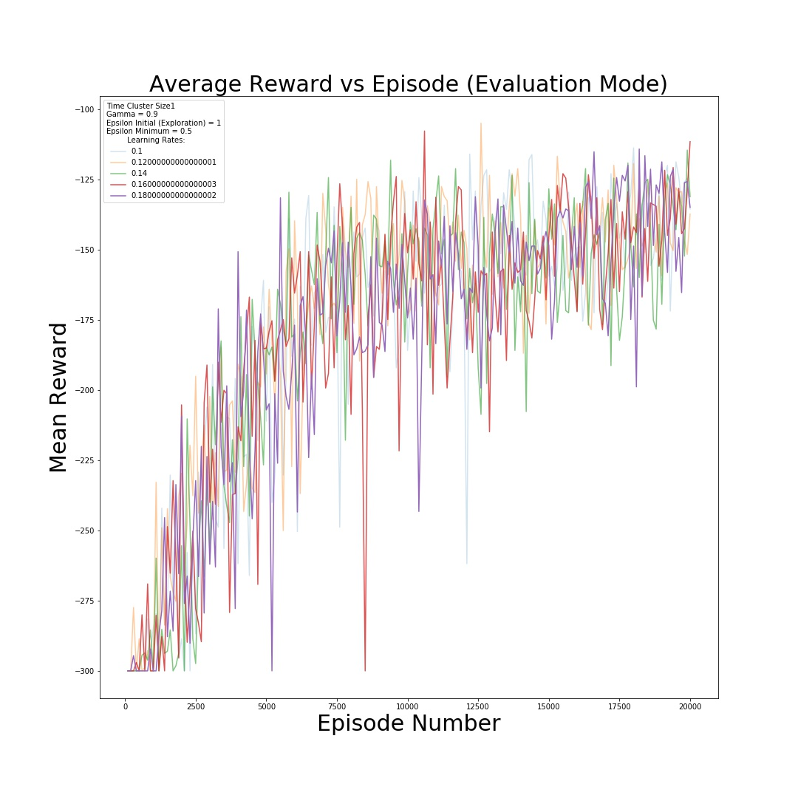
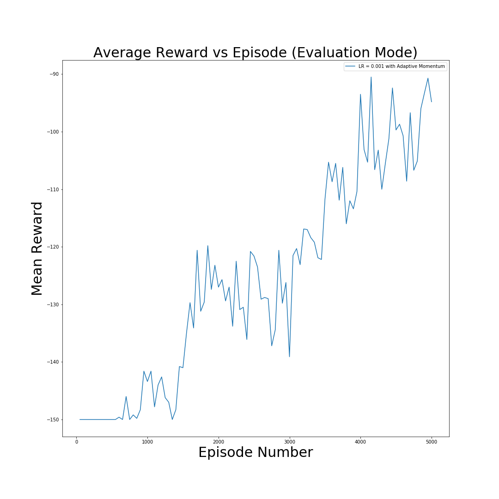

# Deep Reinforcement Learning (DRL)

This repo documents the development of a set
of Reinforcement Learning (RL) models based
on well-known machine learning algorithms.
The objective of these models is to demonstrate
how both on-policy and off-policy methods can
be applied to agent training in the context of
Markov Decision Processes (MDP) to produce
equivalent optimal policies for a given reward
scheme.

In particular, Policy Iteration and Q-learning
are implemented to find an optimal policy
in a simulated maze environment given a
set of constraints. In addition, Q-learning
and REINFORCE models are developed for
two off-the-shelf OpenAI gym environments,
MountainCar-v0 and Acrobot-v1.

## DRL Results and Learning Curves

